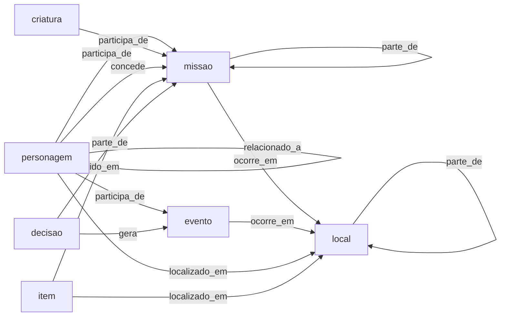

# Ontologia do GameMind (versão 0.1)

## Objetivo e princípios
- **Simples:** 7 tipos e 8 relações, o suficiente para representar a jornada do jogador.
- **Alinhada ao jogo:** os tipos seguem as seções do Journal do The Witcher 3 (Quests, Characters, Locations, Monsters, Formula, Ingredients, Glossary, Tutorials).
- **Só o que o jogador viu:** cada elemento nasce de uma fonte (screenshot ou clipe), o que evita spoiler.
- **Avaliável:** tudo o que está aqui pode ser anotado no gabarito e comparado com a previsão.
- **Reaproveitável:** tipos e relações genéricos; o que é específico do jogo vai em `subtipo`, texto livre e não avaliado.

Método: roteiro simplificado de Noy e McGuinness (2001): escopo e perguntas, termos, classes, relações, atributos e exemplos.

## Perguntas que o grafo deve responder
| Pergunta do jogador | Como o grafo responde |
|---|---|
| Quem é X e onde o vi? | nota do personagem, com `localizado_em` e as fontes |
| Que missões estão em andamento e onde? | missões com `estado` e `ocorre_em` |
| Quem me deu essa missão? | `concede` |
| Quem participou desta missão ou evento? | `participa_de` (relações recebidas) |
| O que decidi e o que isso gerou? | decisão `parte_de` missão e `gera` evento |
| Onde achei este item? | `localizado_em` ou `obtido_em` |
| Como X e Y se relacionam? | `relacionado_a` com `rotulo` |

## Tipos
| Tipo | Definição | Subtipos sugeridos (texto livre) | Seção do Journal | Exemplo |
|---|---|---|---|---|
| personagem | Pessoa com nome e papel na história | protagonista, aliado, comandante | Characters | Vesemir |
| criatura | Monstro ou animal do bestiário | grifo, espectro | Monsters | Royal Griffin |
| local | Região, cidade, construção ou ponto de interesse | região, cidade, taverna | Locations | White Orchard |
| missao | Missão principal, secundária, contrato ou caça ao tesouro | principal, secundaria, contrato, caca_ao_tesouro | Quests | Lilac and Gooseberries |
| item | Objeto, arma, ingrediente, fórmula ou livro | ingrediente, formula, arma, livro | Ingredients, Formula | Buckthorn |
| evento | Acontecimento com começo e fim (cena, ataque, encontro) | n/a | atualizações e cenas | Wild Hunt attack on the convoy |
| decisao | Escolha do jogador com possível consequência | n/a | escolhas de diálogo | Answers to Emhyr about Letho |

Regras de fronteira:
- **Evento × decisão:** se o jogador escolheu, é decisão; se apenas aconteceu, é evento.
- **Glossário:** se a entrada descreve personagem, local ou criatura, usa-se o tipo correspondente. Conceitos abstratos ficam fora na versão 0.1.

## Relações
| Predicado | Domínio → alcance | Significado | Exemplo |
|---|---|---|---|
| participa_de | personagem, criatura → missão, evento | Atua na missão ou evento | Vesemir participa_de Lilac and Gooseberries |
| ocorre_em | missão, evento → local | Onde acontece | Imperial Audience ocorre_em Vizima |
| localizado_em | personagem, criatura, item → local | Onde está ou foi encontrado | Buckthorn localizado_em White Orchard |
| parte_de | local → local; missão → missão; decisão, evento → missão | Composição ou subordinação | The Beast of White Orchard parte_de Lilac and Gooseberries |
| concede | personagem → missão | Quem dá a missão | Peter Saar Gwynleve concede The Beast of White Orchard |
| obtido_em | item → missão, evento | Onde ou como foi obtido | recompensa de missão |
| gera | decisão, evento → evento | Consequência | decisão gera evento |
| relacionado_a | personagem, criatura → personagem, criatura | Vínculo entre eles, com `rotulo` | Yennefer relacionado_a Geralt (rótulo "ex-amantes") |

`rotulo` guarda o tipo de vínculo (aliado, inimigo, mentor, familiar) e não entra na avaliação. Isso mantém poucos predicados e ainda permite distinguir vínculos na nota do Obsidian.

## Atributos
**Por item anotado** (`src/schema.py`): nome, tipo, subtipo, estado (só missão: ativa, concluida, falhou) e evidência.

**No grafo consolidado** (`src/grafo.py`): nome canônico, aliases, tipo, subtipo, descrição, estado (o mais recente vence), `primeira_vez` (arquivo em que apareceu primeiro, na ordem do jogo) e fontes com evidência; nas arestas, rótulo e fontes. `confianca` fica prevista para a extração com IA.

**Decisões:** a decisão é um nó ligado à missão (`parte_de`) e ao evento que gera (`gera`). A opção escolhida e as alternativas ficam na descrição ou em observações, em texto livre.

## Identidade e fusão de entidades
- Chave: nome normalizado (sem acento nem maiúsculas) + tipo.
- Aliases apontam para o nome canônico (ex.: "Geralt" e "White Wolf" para "Geralt of Rivia").
- Mesmo nome com tipos diferentes não se funde.
- Quando o mesmo elemento aparece com nomes diferentes, vale o nome da fonte mais completa.
- Um idioma só para os nomes: o do jogo usado no projeto.

## Anti-spoiler
- Toda entidade e relação tem pelo menos uma fonte.
- Descrições e atributos vêm só do conteúdo visto; nada é importado de wikis.
- `primeira_vez` permite consultar "o que sei até aqui".
- Não há relação de ordem entre missões (`precede`), porque a missão seguinte pode ser spoiler.

## Fora do escopo da versão 0.1
Facções e grupos, atributos de combate de itens, Gwent, cronologia detalhada, relação de ordem entre missões, conceitos abstratos do glossário e transcrição completa de falas.

## Decisões presumidas (confirmar)
1. `criatura` é tipo separado, porque o Journal tem a seção Monsters.
2. Oito relações; aliado e inimigo viram `relacionado_a` com rótulo.
3. Decisão é um nó, ligada por `parte_de` e `gera`.
4. Conceitos abstratos do glossário ficam fora.
5. Nomes no idioma do jogo: **decidido em 2026-10-05, português do Brasil (pt-BR)**. Os exemplos em `docs/exemplo/` seguem em inglês e só demonstram o pipeline.

## Como validar na Semana 4
- Anotar as telas do teste de fumaça com esta ontologia. Se muitas entidades não couberem em nenhum tipo (por exemplo, mais de 10%), revisar.
- Rodar `python scripts/validar_gabarito.py` (confere tipos, nomes e domínio e alcance dos predicados).
- Abrir `docs/exemplo/vault` no Obsidian e conferir se o grafo responde às perguntas acima.

## Fontes consultadas
- Witcher Wiki (Fandom), página do Journal: seções do diário do jogo.
- Giant Bomb, The Witcher 3: glossário do jogo com personagens, bestiário e mecânicas.
- Guias e listas de missões do prólogo (guides4gamers, game-checklists, game8): exemplo do grafo.
- Noy e McGuinness (2001), Ontology Development 101.
