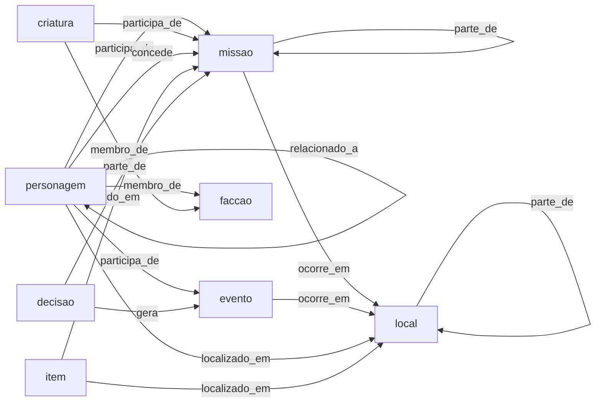

# Ontologia do GameMind (versão 1.1, congelada em 2026-10-08)

A análise e as decisões do fechamento estão em `docs/decisoes/002-ontologia-1-0.md`, com a emenda que criou a 1.1 (tipo `faccao` e predicado `membro_de`). Mudanças depois deste ponto só entram como 1.2, com nova decisão registrada.

## Objetivo e princípios
- **Simples:** 8 tipos e 9 relações, o suficiente para representar a jornada do jogador.
- **Alinhada ao jogo:** os tipos seguem as seções do Journal do The Witcher 3 (Quests, Characters, Locations, Monsters, Formula, Ingredients, Glossary, Tutorials).
- **Só o que o jogador viu:** cada elemento nasce de uma fonte (screenshot ou clipe), o que evita spoiler.
- **Avaliável:** tudo o que está aqui pode ser anotado no gabarito e comparado com a previsão.
- **Reaproveitável:** tipos e relações genéricos; o que é específico do jogo vai em `subtipo`, texto livre e não avaliado.

Método: roteiro simplificado de Noy e McGuinness (2001): escopo e perguntas, termos, classes, relações, atributos e exemplos.

## Perguntas que o grafo deve responder
| Pergunta do jogador | Como o grafo responde |
|---|---|
| Quem é X e onde o vi? | nota do personagem, com `localizado_em` e as fontes |
| Que missões estão em andamento e onde? | missões com `estado` e `ocorre_em` |
| Quem me deu essa missão? | `concede` |
| Quem participou desta missão ou evento? | `participa_de` (relações recebidas) |
| O que decidi e o que isso gerou? | decisão `parte_de` missão e `gera` evento |
| Onde achei este item? | `localizado_em` ou `obtido_em` |
| Como X e Y se relacionam? | `relacionado_a` com `rotulo` |
| A que grupo X pertence? | `membro_de` |

## Tipos
| Tipo | Definição | Subtipos sugeridos (texto livre) | Seção do Journal | Exemplo |
|---|---|---|---|---|
| personagem | Pessoa com nome e papel na história | protagonista, aliado, comandante | Characters | Vesemir |
| criatura | Monstro ou animal do bestiário | grifo, espectro | Monsters | Royal Griffin |
| local | Região, cidade, construção ou ponto de interesse | região, cidade, taverna | Locations | White Orchard |
| missao | Missão principal, secundária, contrato ou caça ao tesouro | principal, secundaria, contrato, caca_ao_tesouro | Quests | Lilac and Gooseberries |
| item | Objeto, arma, ingrediente, fórmula ou livro | ingrediente, formula, arma, livro | Ingredients, Formula | Buckthorn |
| evento | Acontecimento com começo e fim (cena, ataque, encontro) | n/a | atualizações e cenas | Wild Hunt attack on the convoy |
| decisao | Escolha do jogador com possível consequência | n/a | escolhas de diálogo | Answers to Emhyr about Letho |
| faccao | Grupo organizado com nome próprio (reino, exército, ordem, escola, organização) | reino, exército, escola, organização | texto de glossário, diário e quadros de avisos | Nilfgaard, Escola do Lobo |

Regras de fronteira:
- **Facção × local:** "Nilfgaard" como povo ou exército é facção; "Guarnição Nilfgaardiana" como lugar é local. Se o nome for igual, o sufixo desambigua, como nas missões.
- **Facção só com nome escrito:** como nos demais tipos, vale o nome visível na tela, e relações entre facções (aliança, guerra) ficam de fora.
- **Evento × decisão:** se o jogador escolheu, é decisão; se apenas aconteceu, é evento.
- **Glossário:** se a entrada descreve personagem, local ou criatura, usa-se o tipo correspondente. Conceitos abstratos ficam fora na versão 0.1.

## Elementos em reserva
`evento` e `gera` não têm nenhum uso no gabarito (54 arquivos). Seguem na 1.0 porque vídeo de cutscene pode trazer eventos, mas ficam fora das métricas principais e são reavaliados na avaliação comparativa (Semana 15); sem uso real até lá, saem na 1.1.

## Relações
| Predicado | Domínio → alcance | Significado | Exemplo |
|---|---|---|---|
| participa_de | personagem, criatura → missão, evento | Atua na missão ou evento | Vesemir participa_de Lilac and Gooseberries |
| ocorre_em | missão, evento → local | Onde acontece | Imperial Audience ocorre_em Vizima |
| localizado_em | personagem, criatura, item → local | Onde está ou foi encontrado | Buckthorn localizado_em White Orchard |
| parte_de | local → local; missão → missão; decisão, evento → missão | Composição ou subordinação | The Beast of White Orchard parte_de Lilac and Gooseberries |
| concede | personagem → missão | Quem dá a missão | Peter Saar Gwynleve concede The Beast of White Orchard |
| obtido_em | item → missão, evento | Onde ou como foi obtido | recompensa de missão |
| gera | decisão, evento → evento | Consequência | decisão gera evento |
| membro_de | personagem, criatura → facção | Pertence ao grupo | Vesemir membro_de Escola do Lobo |
| relacionado_a | personagem, criatura → personagem, criatura | Vínculo entre eles, com `rotulo` | Yennefer relacionado_a Geralt (rótulo "ex-amantes") |

`rotulo` guarda o tipo de vínculo (aliado, inimigo, mentor, familiar) e não entra na avaliação. Isso mantém poucos predicados e ainda permite distinguir vínculos na nota do Obsidian.

## Atributos
**Por item anotado** (`src/schema.py`): nome, tipo, subtipo, estado (só missão: ativa, disponivel, concluida ou falhou; `disponivel` é o contrato visto em quadro de avisos e ainda não aceito) e evidência.

**No grafo consolidado** (`src/grafo.py`): nome canônico, aliases, tipo, subtipo, descrição, estado (o mais recente vence), `primeira_vez` (arquivo em que apareceu primeiro, na ordem do jogo) e fontes com evidência; nas arestas, rótulo e fontes. `confianca` fica prevista para a extração com IA.

**Decisões:** a decisão é um nó ligado à missão (`parte_de`) e ao evento que gera (`gera`). A opção escolhida e as alternativas ficam na descrição ou em observações, em texto livre.

## Identidade e fusão de entidades
- Chave: nome canônico normalizado (sem acento nem maiúsculas). O tipo **não** entra na chave, porque `grafo.py` e o validador resolvem nomes sem olhar o tipo.
- Aliases apontam para o nome canônico (ex.: "Geralt" e "White Wolf" para "Geralt of Rivia").
- Mesmo nome para tipos diferentes é desambiguado com sufixo no nome canônico, como "Kaer Morhen (missão)" para a missão que tem o nome da fortaleza.
- Quando o mesmo elemento aparece com nomes diferentes, vale o nome da fonte mais completa.
- Um idioma só para os nomes: o do jogo usado no projeto.

## Anti-spoiler
- Toda entidade e relação tem pelo menos uma fonte.
- Descrições e atributos vêm só do conteúdo visto; nada é importado de wikis.
- `primeira_vez` permite consultar "o que sei até aqui".
- Não há relação de ordem entre missões (`precede`), porque a missão seguinte pode ser spoiler.

## Fora do escopo da versão 1.1
Relações entre facções (aliança, guerra, hierarquia), atributos de combate de itens, Gwent, cronologia detalhada, relação de ordem entre missões, conceitos abstratos do glossário e transcrição completa de falas.

## Decisões fechadas
1. `criatura` é tipo separado, porque o Journal tem a seção Monsters.
2. Oito relações; aliado e inimigo viram `relacionado_a` com rótulo.
3. Decisão é um nó, ligada por `parte_de` e `gera`.
4. Conceitos abstratos do glossário ficam fora (menos de 5% do conteúdo do corpus).
5. Nomes no idioma do jogo: português do Brasil (pt-BR). Os exemplos em `docs/exemplo/` seguem em inglês e só demonstram o pipeline.
6. `evento` e `gera` em reserva; chave de identidade sem tipo; estado `disponivel` incluído (decisão 002).
7. Facção entra como tipo, com `membro_de` como único predicado novo (emenda 1.1 da decisão 002, 2026-10-08).

## Validação (feita em 2026-10-08)
- Gabarito com 54 arquivos anotados com esta ontologia. Com facções incluídas, sobra fora de escopo só Gwent, cartas e categorias do bestiário, em menos de 3% do conteúdo (limite de revisão: 10%).
- `python scripts/validar_gabarito.py data/gabarito`: 0 problemas (tipos, nomes e domínio e alcance dos predicados).
- Das 7 perguntas do jogador, 6 são respondidas pelo grafo; "o que isso gerou?" só até a decisão, por não haver consequência na tela.

## Histórico
- 0.1 (2026-10-02): 7 tipos, 8 relações, rascunho.
- 1.0 (2026-10-08): congelada. Ajustes de definição: estado `disponivel`, chave sem tipo, `evento` e `gera` em reserva.
- 1.1 (2026-10-08): tipo `faccao` e predicado `membro_de`, depois de medir que nomes de facção aparecem em pelo menos 17% das telas que não são tutorial. Nenhuma outra mudança.

## Fontes consultadas
- Witcher Wiki (Fandom), página do Journal: seções do diário do jogo.
- Giant Bomb, The Witcher 3: glossário do jogo com personagens, bestiário e mecânicas.
- Guias e listas de missões do prólogo (guides4gamers, game-checklists, game8): exemplo do grafo.
- Noy e McGuinness (2001), Ontology Development 101.
